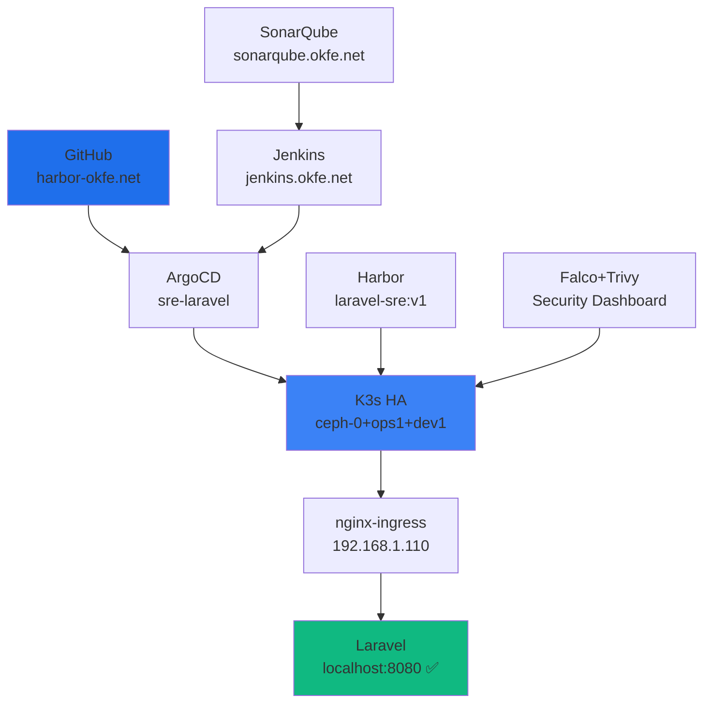
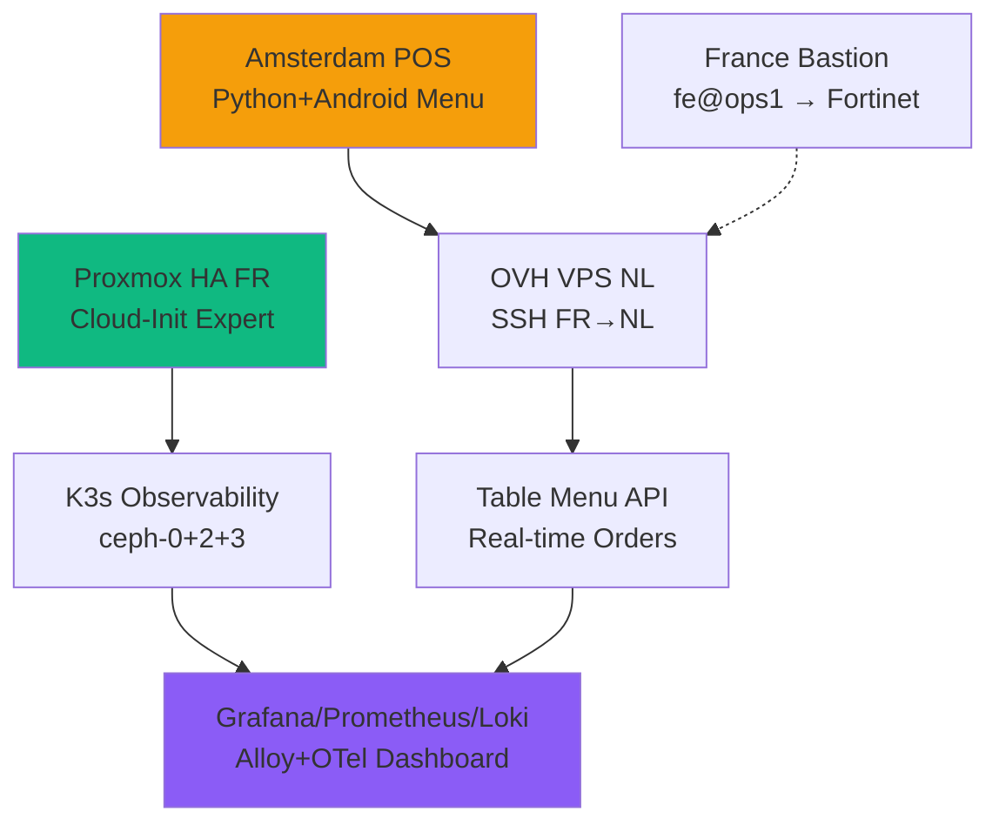

<div align="center">
  
<!-- BARIS 1: EMAS MURNI + LOGO PUTIH -->


<!-- BARIS 2: KUNING SEDANG + LOGO PUTIH -->


<!-- BARIS 3: KUNING CERAH + LOGO PUTIH -->


</div>

<div align="center">
  
</div>

<p align="center">
  <a href="https://komarev.com/ghpvc/?username=matahariku&style=for-the-badge&color=1d4ed8&label=PROFILE+VIEWS">
    
  </a>
</p>

<p align="center">
  <a href="https://www.linkedin.com/in/farida-eryani-257480172/">
    
  </a>
  
</p>

---

## 🧑‍💻 **À propos**
```yaml
name:     Farida ERYANI
role:     Ingénieure DevOps SRE - CKA Certified (CDI/CDD/Freelance)
location: Bordeaux, France 🇫🇷 (Toulouse/Marseille/Paris)

background: 
  - Laravel SRE GitOps (04/2026 → LIVE)
  - Amsterdam POS Hybrid (04/2025-03/2026)
  - E-Santé Bretagne DevOps (2023-2025)
  - IRIS IT SysAdmin (2022-2023)
```

---

## 🛠️ **Stack Technique**

| **Domain** | **Expertise** |
|------------|---------------|
| **🧠 Container** | Docker • **Kubernetes CKA** • Ceph-Rook • GlusterFS |
| **🔧 IaC** | **Terraform** • **Ansible** • **ArgoCD** • Helm • Kustomize |
| **⚡ CI/CD** | **GitHub Actions** • **Jenkins** • GitLab CI • Gitea |
| **☁️ Cloud** | **Proxmox HA** • **Cloud-Init** • AWS • Azure • OVH |
| **📈 Observabilité** | **Grafana** • **Prometheus** • **Loki** • Jaeger • Tempo • OTel |
| **🛡️ Sécurité** | **Trivy** • **Falco** • **SonarQube** • Vault • **Fortinet HA** • Harbor |
| **💾 Stockage** | Ceph-Rook • Velero • AWS S3 • GlusterFS |
| **🌐 Réseaux** | **Fortinet** • Cisco • pfSense • VLAN/VPN/SD-WAN • NGINX • HAProxy |
| **💻 Langages** | Bash • Python • PHP/Laravel • **Golang** |

---

## 🎯 **Projets LIVE (SRE Production)**

| **Projet** | **Description** | **URL Live** | **Status** |
|------------|-----------------|--------------|------------|
| **Laravel SRE** | GitOps→ArgoCD→K3s→nginx-ingress | `localhost:8080` | 🟢 **LIVE** |
| **Grafana Dash** | Observabilité full-stack | `grafana.okfe.net` | 🟢 **LIVE** |
| **ArgoCD UI** | GitOps dashboard | `argocd.okfe.net` | 🟢 **LIVE** |
| **Harbor Reg** | Private registry | `harbor.okfe.net` | 🟢 **LIVE** |
| **Jenkins CI** | Pipeline automation | `jenkins.okfe.net` | 🟢 **LIVE** |
| **SonarQube** | Code quality | `sonarqube.okfe.net` | 🟢 **LIVE** |
| **GitLab** | Source management | `gitlab.com/matahariku` | 🟢 **LIVE** |

**Cluster K3s:** `ceph-0(Ready) • ops1(Ready) • dev1(Ready)` ✅

---

## 🔭 **Flowchart Laravel SRE Pipeline**



---

## 🌐 **Flowchart Amsterdam POS (Hybrid Infra)**



---

## 🏅 **Certification**

[](https://www.credly.com/badges/bd619a68-ce90-4a48-978c-e3bcefa0858c)

---

## 📊 **GitHub Stats** (Avril 2026)

**244 contributions** • **24 repositories**  
**Top:** Farida-Eryani • project-Amsterdam • K8s-Observability

[](https://github.com/matahariku)

---

## 📫 **Contact Professionnel**

<div align="center">
**🏢 Régions:** Toulouse • Marseille • Paris • Bordeaux • Aix • Toulon  
**💼 Disponible:** ✅ **CDI/CDD/Freelance IMMÉDIAT**  
**🔗** [✉️ Email](mailto:febdx33000@gmail.com) | [🔗 LinkedIn](https://linkedin.com/in/farida-eryani-257480172)

[](https://linkedin.com/in/farida-eryani-257480172/)
[](mailto:febdx33000@gmail.com)
</div>

---

<div align="center">

</div>
