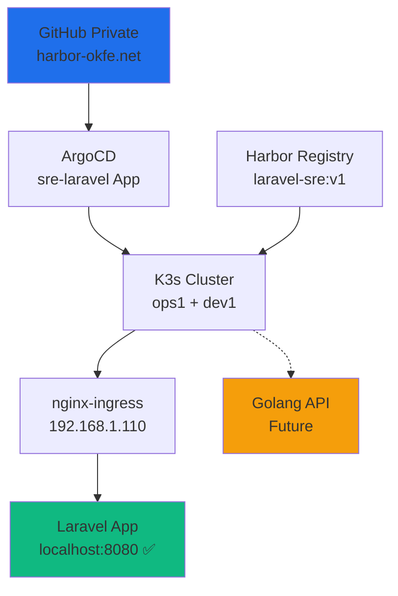

<div align="center">
  
<!-- BARIS 1: EMAS MURNi + LOGO PUTIH -->


<!-- BARIS 2: KUNING SEDANG + LOGO PUTIH -->


<!-- BARIS 3: KUNING CERAH + LOGO PUTIH -->


</div>

<div align="center">
  
</div>

<p align="center">
  <a href="https://komarev.com/ghpvc/?username=matahariku&style=for-the-badge&color=1d4ed8&label=PROFILE+VIEWS">
    
  </a>
</p>

<p align="center">
  <a href="https://www.linkedin.com/in/farida-eryani-257480172/">
    
  </a>
  
</p>

---

## 🧑‍💻 **À propos**
```yaml
name:     Farida ERYANI
role:     Ingénieure DevOps - CKA Certified (disponible CDI/CDD)
location: Bordeaux, France 🇫🇷
```

---

## 🛠️ **Stack Technique**

| **Catégorie** | **Technologies** |
|---------------|------------------|
| 🧠 **Container** | Docker • Kubernetes CKA • Ceph-Rook • GlusterFS |
| 🔧 **IaC** | Terraform • Ansible • ArgoCD • Helm • Kustomize |
| ⚡ **CI/CD** | GitHub Actions • Jenkins • GitLab CI • Gitea |
| ☁️ **Cloud** | AWS • Azure • OVH • Proxmox HA • VMware |
| 📈 **Observabilité** | Grafana • Prometheus • Loki • Jaeger • Tempo |
| 🛡️ **Sécurité** | Trivy • SonarQube • Vault • Falco • Harbor |
| 💾 **Stockage** | Ceph-Rook • Velero • AWS S3 • GlusterFS |
| 💻 **Langages** | Bash • Python • PHP/Laravel • Golang |

---

## 🎯 **Projets LIVE (SRE Production)**

| **Projet** | **Description** | **URL Live** | **Status** |
|------------|-----------------|--------------|------------|
| **Laravel SRE** | GitOps → ArgoCD → K3s → nginx-ingress | [localhost:8080](http://localhost:8080) | 🟢 **LIVE** |
| **Golang API** | Backend metrics (future) | Coming soon | 🟡 **Plan** |
| **Grafana Dash** | Observabilité full-stack | monitoring.okfe.net | 🟢 **LIVE** |
| **ArgoCD UI** | GitOps dashboard | argocd.okfe.net | 🟢 **LIVE** |
| **Harbor Reg** | Private container registry | harbor.okfe.net | 🟢 **LIVE** |

---

## 🔭 **Flowchart SRE Pipeline**



---

## 🏅 **Certification**

[](https://www.credly.com/badges/bd619a68-ce90-4a48-978c-e3bcefa0858c)

---

## 📊 **GitHub Stats**

**244 contributions** (Mars 2026)  
**Top repos:** Farida-Eryani • project-Amsterdam • K8s-Observability

[](https://github.com/matahariku)

---

## 📫 **Contact**

<div align="center">
**🏢 Régions:** Toulouse • Marseille • Paris • Bordeaux  
**💼 Statut:** ✅ CDI/CDD/Freelance immédiat  
**🔗** [✉️ Email](mailto:febdx33000@gmail.com) | [🔗 LinkedIn](https://linkedin.com/in/farida-eryani-257480172)
</div>

---

**"Kubernetes CKA + GitOps ArgoCD + Terraform + Observabilité Expert"** 🇫🇷🚀
