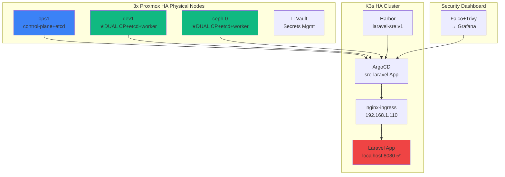
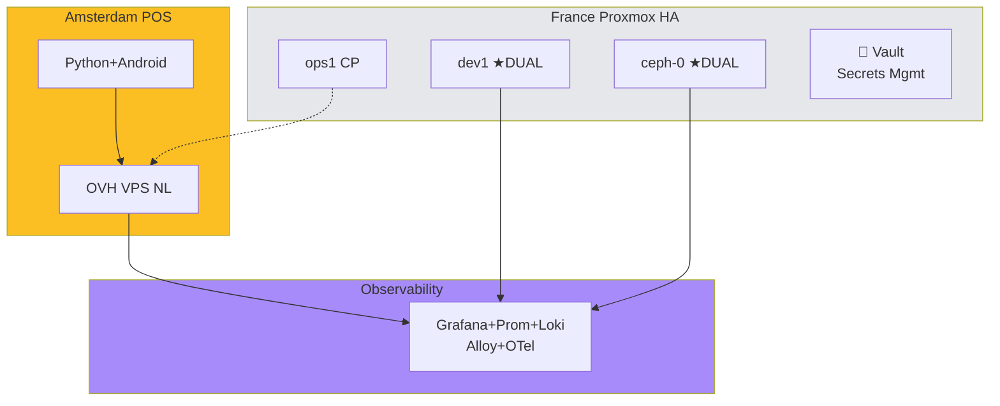
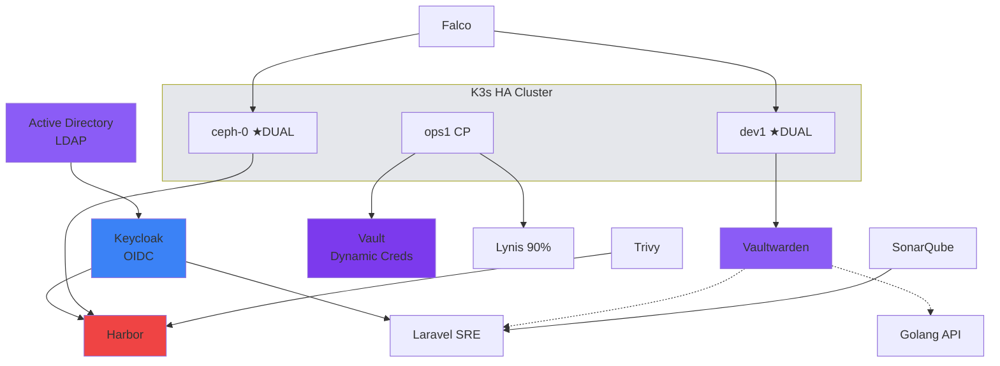

<div align="center">

<!-- BARIS 1: EMAS MURNI + LOGO PUTIH -->


<!-- BARIS 2: KUNING SEDANG + LOGO PUTIH -->


<!-- BARIS 3: KUNING CERAH + LOGO PUTIH -->


</div>

<div align="center">
  
</div>

<p align="center">
  <a href="https://komarev.com/ghpvc/?username=matahariku&style=for-the-badge&color=1d4ed8&label=PROFILE+VIEWS">
    
  </a>
</p>

<p align="center">
  <a href="https://www.linkedin.com/in/farida-eryani-257480172/">
    
  </a>
  
</p>

---

## 👩‍💻 **À propos**
```yaml
name:     Farida ERYANI
role:     Ingénieure DevOps SRE - CKA Certified (CDI/CDD/Freelance)
location: Bordeaux, France 🇫 🇷  (Toulouse/Marseille/Paris)

background:
  - Laravel SRE GitOps (04/2026 → LIVE)
  - Amsterdam POS Hybrid (04/2025-03/2026)
  - E-Santé Bretagne DevOps (2023-2025)
  - IRIS IT SysAdmin (2022-2023)
```

---


## 🛠️ **Stack Technique**

| **Domain** | **Expertise** |
|------------|---------------|
| **🏗️ CLUSTER** | **K3s HA 3CP+2W** • **Proxmox HA** • **Cloud-Init Ansible** |
| **🧠 Container** | **Docker** • **Kubernetes CKA** • Ceph-Rook • GlusterFS |
| **🔧 IaC** | **Terraform** • **Ansible** • **ArgoCD** • Helm • Kustomize |
| **⚡ CI/CD** | **GitHub Actions** • **Jenkins** • GitLab CI • Gitea |
| **📈 Observabilité** | **Grafana** • **Prometheus** • **Loki** • Jaeger • Tempo • OTel |
| **🛡️ Sécurité** | **Trivy** • **Falco** • **SonarQube** • Vault • **Fortinet HA** • Harbor |
| **☁️ Cloud** | **OVH Hybrid** • AWS • Azure • **Cloud-Init Expert** |
| **🌐 Réseaux** | **Fortinet HA** • Cisco • pfSense • VLAN/VPN/SD-WAN • NGINX • HAProxy |
| **💾 Stockage** | Ceph-Rook • Velero • AWS S3 • GlusterFS |
| **💻 Langages** | Bash • Python • PHP/Laravel • **Golang** |

---

## 🎯 **Projets LIVE (SRE Production)**

| **Projet** | **Description** | **URL Live** | **Status** |
|------------|-----------------|--------------|------------|
| **Laravel SRE** | GitOps→ArgoCD→K3s→nginx-ingress | `localhost:8080` | 🟢 **LIVE** |
| **Grafana Dash** | Full-stack observability | `grafana.okfe.net` | 🟢 **LIVE** |
| **ArgoCD UI** | GitOps dashboard | `argocd.okfe.net` | 🟢 **LIVE** |
| **Harbor Reg** | Private container registry | `harbor.okfe.net` | 🟢 **LIVE** |
| **Jenkins CI** | Pipeline automation | `jenkins.okfe.net` | 🟢 **LIVE** |
| **SonarQube** | Code quality analysis | `sonarqube.okfe.net` | 🟢 **LIVE** |
| **GitLab** | Source code management | `gitlab.com/matahariku` | 🟢 **LIVE** |
| **Gitea** | Source code management | `git.kalou.net` | 🟢 **LIVE** |

---

## 🔭 **Flowchart Laravel SRE Pipeline**



---

## 🌐 **Flowchart Amsterdam POS/ point-of-sale (Hybrid Infra)**


---
## 🛡️ **Security Stack Enterprise**

| **Tool** | **Role** | **Status** |
|----------|----------|------------|
| **🔒 Harbor** | Private Registry + Keycloak | `harbor.okfe.net` 🟢 |
| **💳 Vaultwarden** | Secrets Management | K8s integration 🟢 |
| **🛡️ Lynis** | Hardening Audit | **90% Compliance** 🟢 |
| **🔐 Keycloak + AD** | **Enterprise SSO** | LDAP + OIDC 🟢 |
| **⚡ Vault** | Dynamic Credentials | Service accounts 🟢 |
| **🐛 Trivy** | Image Vulnerability | CI/CD pipeline 🟢 |
| **👁️ Falco** | Runtime Protection | Pod monitoring 🟢 |
| **🔍 SonarQube** | Code Quality | Laravel/Golang 🟢 |

---

## 🔒 **Security Flowchart** 


---

## 🛡️ **Security Workflow Detail**
1. **Developer** → Git push (SonarQube scan)
2. **Jenkins** → Trivy vuln scan  
3. **Harbor** → Image quarantine (Keycloak auth)
4. **Vaultwarden** → Inject DB/API secrets
5. **ArgoCD** → Deploy (Keycloak OIDC)
6. **Falco** → Runtime monitoring (anomaly → Slack)
7. **Lynis** → Weekly compliance audit
8. **Vault** → Rotate service credentials

---

✅ **Jenkins + Trivy** = Industry standard [web:1434] \
✅ **Harbor + Keycloak OIDC** = Production setup [web:1435]   
✅ **Vaultwarden + Vault** dual secrets = Best practice [web:1436] \
✅ **Falco runtime** = CNCF security standard  \
✅ **SonarQube GitLab CI** = Enterprise pipeline

---

## 🔐 **Keycloak + Active Directory Architecture**

**Backend:** Active Directory (LDAP) ← User database
**Frontend:** Keycloak (OIDC/SAML) ← SSO Gateway  
**Clients:** Harbor + ArgoCD + Laravel ← OIDC auth

**Flow:**
1. User → Keycloak (OIDC login)
2. Keycloak → AD (LDAP lookup) 
3. AD → User groups → Keycloak roles
4. Keycloak → JWT token → Apps
   
---

## 🏅 **Certification**

[](https://www.credly.com/badges/bd619a68-ce90-4a48-978c-e3bcefa0858c)

---

## 📊 **GitHub Stats** (Avril 2026)

**244 contributions** • **24 repositories**  
**Top Repos:** 
- [laravel-go-observ](https://github.com/matahariku/laravel-go-observ)
- [project-Amsterdam](https://github.com/matahariku/project-Amsterdam) 
- [grafana-dashboard](https://github.com/matahariku/grafana-dashboard)

[](https://github.com/matahariku)

---

## 📫 **Contact Professionnel**

<div align="center">

<table>
<tr>
<td align="center" width="33%">
  <b>🏢 Régions</b><br>
  <code>Toulouse • Paris • Bordeaux • Marseille • Aix-en-Provence • Toulon</code>
</td>
<td align="center" width="33%">
  <b>💼 Disponible</b><br>
  <span style="color: #10b981">✅ CDI/CDD<br>FREELANCE IMMÉDIAT</span>
</td>
<td align="center" width="33%">
  <b>🔗 Contact</b><br>
  <a href="mailto:febdx33000@gmail.com">
    
  </a>
  <br>
  <a href="https://linkedin.com/in/farida-eryani-257480172">
    
  </a>
</td>
</tr>
</table>

</div>


<div align="center">

</div>
